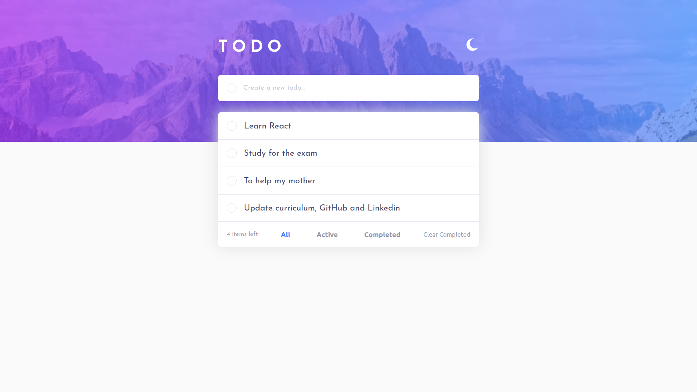
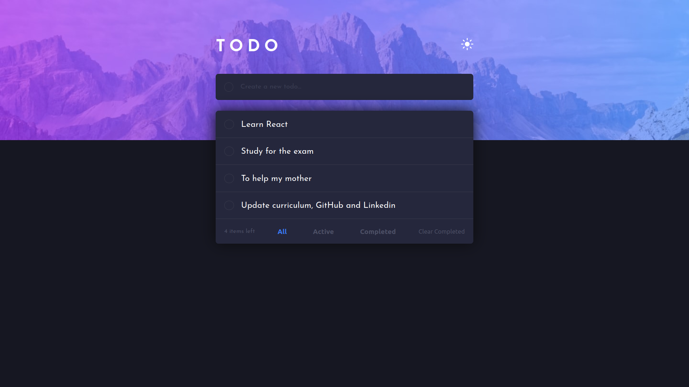

<h1 align="center">Todo</h1>

> A web page in task list format. 


<p align="center">
     
    
    
    
</p> 

<!-- ABOUT --> 
This application allows you to store your daily tasks, which allows greater control and productivity during your day. 

<!-- DEMO --> 
## 🎥 Demo

This project was deployed in [Vercel](https://vercel.com). To see a demo, [click here](https://to-do-app-vitormrts.vercel.app/). 

<div align="center">
    
      
</div>

<!-- TECHONOLOGIES --> 
## 🚀 Technologies
* ✔️ HTML
* ✔️ CSS (SCSS)
* ✔️ JavaScript

<!-- HOW TO USE -->
## ℹ️ How To Use
To modify (locally) this project, you will need [Node](https://nodejs.org/en/) and [GIT](https://git-scm.com/) installed on your computer.

With these tools in hand, follow the steps below
```sh
# Clone this repository
$ git clone https://github.com/vitormrts/to-do-app

# Go to the repository cloned
$ cd to-do-app

# Install dependencies
$ npm install

# Run the app
$ npm run dev
```

Done! Now you have this application in your computer.

<!-- CONTRIBUTING -->
## 🤝 Contributing

To contributing to this project, follow the steps bellow.

1. Fork the Project;
2. Create your Feature Branch (`git checkout -b new-branch`)
3. Commit your Changes (`git commit -m 'DESCRIPTION OF CHANGES'`)
4. Push to the Branch (`git push origin new-branch`)
5. Open a Pull Request

## 📝 License
This project is under the MIT license. See the [LICENSE](https://github.com/vitormrts/to-do-app/blob/master/LICENSE) file for more details.

---

<p align="center">Made with ❤️ by <strong>Vitor Martins ✌ </p>


 
